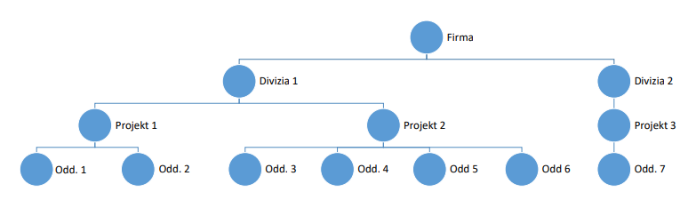

# Organizačná štruktúra firmy

Vytvorte aplikáciu, ktorá umožní spravovať organizačnú štruktúru firmy a evidovať
zamestnancov firmy.

## Požiadavky na program

Umožniť **zobraziť**, **definovať** a **upravovať** max. 4-úrovňovú hierarchickú organizačnú štruktúru firmy: **firma**,
**divízie**, **projekty**, **oddelenia**.

- Každý z uzlov organizačnej štruktúry bude pomenovaný **názvom** a **kódom** a bude mať svojho **vedúceh**o (firma – riaditeľ,
divízia – vedúci divízie, projekt – vedúci projektu, oddelenie – vedúci oddelenia).
- Umožniť **zobraziť**, **pridávať**, **meniť** a **vymazávať** zamestnancov.
- Pre zamestnanca sa bude evidovať minimálne **titul**, **meno** a **priezvisko**, **telefón** (klapka), **mailová adresa**,
**zaradenie** do organizačnej štruktúry.
- Organizačná štruktúra aj zoznam zamestnancov budú uložené v **databáze**.

Použite C# a pre úložisko dát použite Microsoft SQL Server (Express)

**Aplikácia musí byť spustiteľná aj na inom PC!**

K aplikácií je potrebné urobiť návod na spustenie na inom PC. Návod by mal obsahovať **skript**, ktorý si pustí v MSSQL
iný vývojár na svojom PC a vytvorí mu celú štruktúru databázy, **miesto**, kde je uložená cesta k databáze a prípadne
ďalšie potrebné informácie pre spustenie.

Zdrojový kód musí dodržiavať štandardné konvencie jazyka C# a jednotlivé vrstvy musia byť oddelené (GUI, logická, dátová).

**Bonus:** Vykresľujte aktuálnu štruktúru organizácie do GUI.

## Príklad hierarchie

